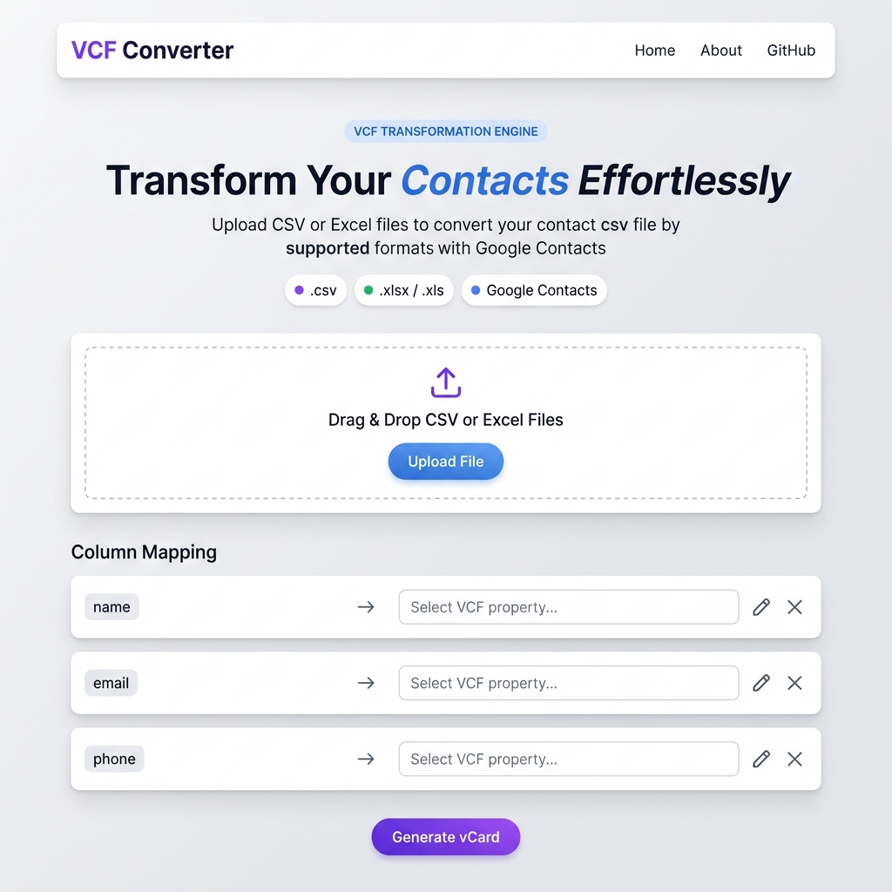

# VCF Converter

Convert your contact spreadsheets to standard vCard format in seconds. Upload CSV or Excel files, map columns to contact properties, and download ready-to-import vCard files for Gmail, Outlook, Apple Contacts, and more.

**Live Demo:** https://convert-to-vcf.vercel.app



## How It Works

```
📂 Upload CSV / XLSX / XLS
        ↓
🗂️  Map your columns  →  FN, EMAIL, TEL, ORG ...
        ↓
✏️  (Optional) Add prefix / postfix per field
        ↓
⬇️  Download clean .vcf file
        ↓
📱 Import into Gmail, Outlook, Apple Contacts, WhatsApp...
```

## Features

- **File Upload** — CSV, XLSX, and XLS format support
- **Column Mapping** — Map spreadsheet columns to vCard properties
- **Data Transformation** — Add prefixes/postfixes to contact fields
- **One-Click Download** — Get standardized vCard files for any contacts app
- **Responsive Design** — Works on desktop and mobile
- **Fast Processing** — Handles large contact lists efficiently

## Built With

- **Frontend** — React 19 with Vite and Tailwind CSS
- **Backend** — FastAPI with Pandas for data processing
- **Deployment** — Vercel

## Project Structure

```
vcf-converter/
├── api/                         # Vercel serverless Python backend
│   ├── index.py                 # FastAPI application (all endpoints)
│   └── requirements.txt
├── frontend/                    # React + Vite SPA
│   ├── src/
│   │   ├── components/          # UI components
│   │   │   ├── Navbar.jsx
│   │   │   ├── Hero.jsx         # Main conversion component
│   │   │   ├── Features.jsx
│   │   │   ├── About.jsx
│   │   │   └── Footer.jsx
│   │   ├── App.jsx
│   │   ├── main.jsx
│   │   └── index.css
│   ├── vite.config.js
│   └── package.json
├── vercel.json                  # Deployment configuration
└── README.md
```

## How to Use

1. **Upload** — Select a CSV or Excel file with your contacts
2. **Map Columns** — Match spreadsheet columns to vCard properties (Name, Email, Phone, etc.)
3. **Customize** (Optional) — Add prefixes or postfixes to any field
4. **Download** — Get your vCard file ready to import
5. **Import** — Open the file in Gmail, Outlook, Apple Contacts, or any contacts app

## Supported Contact Fields

Map your spreadsheet columns to any of these vCard properties:

- **Name** — FN (Full Name), N (Structured Name)
- **Contact** — EMAIL, TEL (with TYPE modifiers: WORK, HOME, MOBILE)
- **Organization** — ORG (Company), TITLE (Job Title)
- **Location** — ADR (Address with TYPE: WORK, HOME)
- **Web** — URL, IMPP
- **Personal** — BDAY (Birthday), ANNIVERSARY, GENDER, PHOTO
- **Other** — NOTE, CATEGORIES, and more

## Details

- Empty rows are automatically removed during processing
- Unknown values (null, undefined, etc.) are treated as empty fields
- Full Name field is auto-generated if not explicitly mapped
- Supports contact lists up to 100 MB

## Local Development

### Prerequisites
- Node.js 18+
- Python 3.8+
- Git

### Setup

**1. Clone the repository**
```bash
git clone https://github.com/suvam-dev/vcf-converter.git
cd vcf-converter
```

**2. Backend Setup**
```bash
cd api
python3 -m venv .venv
source .venv/bin/activate           # Windows: .venv\Scripts\activate
pip install -r requirements.txt
uvicorn index:app --reload          # Runs on http://localhost:8000
```

**3. Frontend Setup** (in a new terminal)
```bash
cd frontend
npm install
npm run dev                         # Runs on http://localhost:5173
```

The frontend automatically proxies API calls to the backend in dev mode. Visit `http://localhost:5173` to test.

### Build for Production

```bash
cd frontend
npm run build                       # Creates dist/ folder
npm run preview                     # Preview production build
```

## Deploy to Vercel

This project is configured for Vercel deployment. The `api/` folder is automatically detected as serverless Python functions.

### Option 1: Deploy via Vercel Dashboard
1. Connect your GitHub repository to Vercel
2. Vercel auto-detects the config from `vercel.json`
3. Push to master — automatic deployment begins

### Option 2: Deploy via Vercel CLI
```bash
npx vercel --prod
```

**Deployment Details:**
- Frontend builds from `frontend/` and is served as a static site
- Backend runs as a serverless function at `/api/*` routes
- Python dependencies are installed from `api/requirements.txt`

## Troubleshooting

**File upload failed**  
Ensure your file is CSV, XLSX, or XLS format and not corrupted.

**Columns not appearing**  
Make sure your spreadsheet has headers in the first row and contains data.

**vCard won't import**  
Try importing into a different contacts app. Check that all columns are properly mapped.

**Other issues**  
Clear your browser cache and try again.

## License

MIT License
